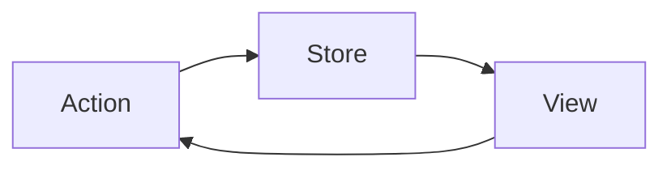

# Redux

To build a data store (container) that manages all of the application states.

## Intro

In Redux we have single source of truth (one store) which is our state.



As an example: state.json

```json
{
  user: {
    name: "Name",
    email: "mail@mail.com",
    preferences: {...}
  },
  posts: [
    {...},
    {...},
    {...}
  ],
  friends: [
    {...},
    {...},
    {...}
  ],
  errors: []
}
```

In Redux modularity is obtained through functions which are managing the single state object.

functions:

- user(): to manage user
- post(): to manage a single post
- allPosts: to manage all posts
- we can use user() to manage each friend
- friends(): to manage entire array of friends
- error(): to manage array of errors

Redux benefits from **Composition** in Store: The *reducer* functions that we create to manage specific parts of the state tree. The **action** and **state** is sent to and piped through each of them until a state is mutated or changed.

All we have to do:

- Identify the state
- Write goode reducers
- Redux store will handle the rest

In functional paradigm we are concerning with the **verbs** instead of nouns (unlike OOP).

- You need to identify all of your **actions** (**constants.js**)
- The variables that these actions impact is our **State** (**initialState.json**).

## Requirements

### Node.js

To init the project:

```powershell
  npm init
```

### Babel.js

To install babel CLI

```powershell
  npm install babel-cli --save-dev
```

To use the latest features of the ES6 spec, we need to install its presets:

```powershell
  npm install babel-preset-latest --save-dev
```

To use experimental features of the ES6 spec, we need to install this presets:

```powershell
  npm install babel-preset-stage-0 --save-dev
```

We use these presets to **transpile** our ES6 code to javascript.

Then, we need to tell Babel which transpiler to use:

1. Create .babelrc file
2. Add preset version

### Configure start command in package.json

```json
  "scripts": {
      "start": "./node_modules/.bin/babel-node ./src/index.js" // index.js is default, so you can just say ./src/
    },
```

## To use Redux

```powershell
  npm install redux --save
```

## Using Webpack

To run our application inside the browser, instead of the server (e.g. Node JS) we need to install **webpack**.

1. So, the first step is to install webpack in order to create bundle.js file:

   ```powershell
    npm install webpack --save-dev
   ```

2. To install **webpack dev server** (will help to automatically recreate the bundle on any changes):

   ```powershell
    npm install webpack-web-server --save-dev
   ```

3. With webpack we need to use loaders. **Loaders** are the instructions that webpack follows when transpiling our code and creating the bundle.

   - The first loader is *babel-loader* (to transpile ES6 to ES5)

   ```powershell
     npm install babel-loader --save-dev
   ```

   - For webpack < v2: Add json-loader for JSON documents (NOT for webpack > 2.0)

   ```powershell
     npm install json-loader --save-dev
   ```

   - Additionally to make sure babel-core has been installed

   ```powershell
     npm install @babel/core --save-dev
   ```

   **Changes:** need to change presets in compared to NodeJS

   ```powershell
     npm install @babel/preset-env --save-dev
   ````

   Change *.babelrc* file to use this preset.

4. Add **webpack.config.js** and configure all (webpack, webpack dev server, and loaders).

5. Use npm start to run dev server
   - make sure to configure start command for node to use webpack-dev-server

## Adding Thunk middleware to Redux

To control action's dispatching (async). For action-creators to wait for results before dispatching an action.

1. Install the package

   ```powershell
     npm install redux-thunk --save
   ```

2. Add it to your store middleware

## Adding express server

```powershell
  npm install express --save
```
