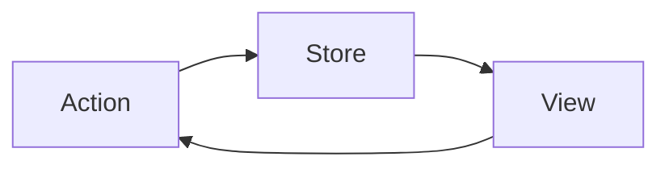

# Redux

To build a data store (container) that manages all of the application states.

## Intro

In Redux we have single source of truth (one store) which is our state.



As an example: state.json

```json
{
  user: {
    name: "Name",
    email: "mail@mail.com",
    preferences: {...}
  },
  posts: [
    {...},
    {...},
    {...}
  ],
  friends: [
    {...},
    {...},
    {...}
  ],
  errors: []
}
```

In Redux modularity is obtained through functions which are managing the single state object.

functions:

- user(): to manage user
- post(): to manage a single post
- allPosts: to manage all posts
- we can use user() to manage each friend
- friends(): to manage entire array of friends
- error(): to manage array of errors

Redux benefits from **Composition** in Store: The *reducer* functions that we create to manage specific parts of the state tree. The **action** and **state** is sent to and piped through each of them until a state is mutated or changed.

All we have to do:

- Identify the state
- Write goode reducers
- Redux store will handle the rest

In functional paradigm we are concerning with the **verbs** instead of nouns (unlike OOP).

- You need to identify all of your **actions** (**constants.js**)
- The variables that these actions impact is our **State** (**initialState.json**).

## Requirements

### Node.js

To init the project:

```powershell
  npm init
```
